# 🎙️ AI-Powered Real-Time Speech Translator


> **Bridging language barriers in real-time through event-driven AI orchestration.**

---

## 📖 Overview

This project implements a high-performance, bidirectional speech-to-speech translation system designed to increase accessibility for multilingual audiences on OTT platforms.

Moving beyond simple transcription, this solution offers a **unified translation engine** capable of processing two distinct audio sources with sub-2-second latency:
1.  **Live Input:** Real-time microphone capture for conversation translation.
2.  **Content Input:** Instant audio extraction and translation of YouTube videos via URL.
3.  **File Input:** Direct upload and processing of pre-recorded audio files (WAV/MP3)


---

## ✨ Key Features

*   **⚡ Low-Latency Orchestration:** Achieves an end-to-end processing time of **<2000ms** using asynchronous Python event loops.
*   **🎥 YouTube Integration:** Integrated `yt-dlp` pipeline to extract, transcode, and translate video audio streams on the fly.
*   **🌍 Multi-Language Support:** Powered by Azure Cognitive Services to support 12+ global languages (English, Hindi, French, German, etc.).
*   **🎨 Modern Bento-Grid Dashboard:** A high-contrast, dark-mode user interface designed for accessibility, featuring real-time status indicators and audio visualization.
*   **🧠 Smart Silence Detection:** Optimized VAD (Voice Activity Detection) to handle natural pauses in speech without cutting context.

---

## 🏗 System Architecture

The system relies on a Python-based orchestrator that manages the flow of data between the Audio I/O layer and Azure Cloud Services.

```mermaid
graph LR
    Input[🎤 Mic / 📺 YouTube] --> Ext[📥 Audio Extractor]
    Ext --> Orchestrator{🐍 Orchestrator}
    Orchestrator --> STT[☁️ Azure STT]
    STT --> Trans[☁️ Azure Translate]
    Trans --> TTS[☁️ Azure TTS]
    TTS --> Speaker[🔊 Audio Output]
    
    style Orchestrator fill:#FF9900,stroke:#333,stroke-width:2px,color:white
    style STT fill:#0078D4,stroke:#333,stroke-width:0px,color:white
    style Trans fill:#107C10,stroke:#333,stroke-width:0px,color:white
    style TTS fill:#5C2D91,stroke:#333,stroke-width:0px,color:white
```



### 📉 Latency Modeling

To ensure real-time performance, the pipeline optimizes the following time-to-audio equation:

<div align="center">
  
</div>


---

## 🚀 User Interface

The application features a modern, Bento-grid style dashboard optimized for clarity.


**Dashboard Elements:**
- Video Speech Translation
- Real-Time & Text Translation
- Batch Processing
- Diagnostics

---

## 🛠️ Tech Stack

| Component       | Technology Used                     |
|----------------|-------------------------------------|
| Core Logic     | Python 3.9+                         |
| Cloud AI       | Azure Speech SDK, Azure Translator  |
| Audio Processing | FFmpeg, PyAudio, yt-dlp          |
| Frontend       | Streamlit (Bento UI)                |
| Data Handling  | Pandas, CSV                         |

---

## ⚙️ Installation & Setup

### 1. Prerequisites
- Python 3.9+
- FFmpeg installed and added to PATH
- Azure Subscription

### 2. Clone and Install

```bash
git clone https://github.com/your-username/Speech_to_speech_project.git
cd Speech_to_speech_project

# Create virtual environment
python -m venv venv
source venv/bin/activate  # Windows: .\venv\Scripts\activate

# Install dependencies
pip install -r requirements.txt
```
### 3. Configuration

Create a `.env` file:

```ini
SPEECH_KEY=your_azure_speech_key
SPEECH_REGION=centralindia
TRANSLATOR_KEY=your_azure_translator_key
TRANSLATOR_REGION=centralindia
```
## 🕹️ Usage Guide

### **Mode A: Live Conversation**

- Run the application:

```bash
streamlit run app.py
```
- Select **RealTime STT & Translation** from the sidebar  
- Click **Start Listening**  
- Speak naturally — the system detects silence and auto-translates  


---

### **Mode B: YouTube Translation**

- Select **Video Speech Translation** from the sidebar  
- Paste a valid link (e.g., news clip, speech)
- Click Process Video
- The system extracts audio, transcribes it, and reads out the translated speech  


---
---

### **Mode C: Batch Processing**

- Select **Batch Processing** from the sidebar
- Upload a supported audio file (WAV)
- The system processes the file and generates the transcript


## 📊 Performance Logs

The system maintains logs to measure translation accuracy and response times.

<details>
<summary><b>📂 Click to view sample CSV Output</b></summary>

| Filename        | Language | Transcript                                   | Translation                                   |
|-----------------|----------|-----------------------------------------------|------------------------------------------------|
| live_rec_01.wav | en-US    | "Historic moment for Indian cricket."        | "भारतीय क्रिकेट के लिए ऐतिहासिक पल।"        |
| yt_clip_04.wav  | hi-IN    | "आज मौसम साफ बना हुआ है..."                 | "The weather remains clear today..."          |

</details>

*© 2025 Project for Infosys Springboard Virtual Internship 6.0*
