# 🎙️ AI-Powered Real-Time Speech Translation


> **Project Goal:** To develop a real-time, speech-to-speech translation system capable of converting live spoken content (English/Hindi) into 12+ languages, increasing accessibility for multilingual audiences on OTT platforms.

---

## 📑 Table of Contents
1. [System Architecture](#architecture)
2. [Setup & Installation](#setup)
3. [Milestone 1: Speech Recognition](#milestone1)
4. [Milestone 2: Translation Module](#milestone2)
5. [Milestone 3: Real-Time Integration](#milestone3)

---

## <a name="architecture"></a>🏗 System Architecture

*High-level data flow illustrating the central Python orchestrator managing interactions between Speech-to-Text, Translation, and Text-to-Speech services.*

```mermaid
graph TD
    %% Nodes
    User([👤 User / Mic])
    App{🐍 Python Orchestrator}
    STT[🗣️ Speech-to-Text]
    TR[🌍 Translation]
    TTS[🔊 Text-to-Speech]

    %% Flow
    User -->|1. Speak| App
    App -->|2. Send Audio| STT
    STT -.->|3. Transcribed Text| App
    App -->|4. Send Text| TR
    TR -.->|5. Translated Text| App
    App -->|6. Send Translation| TTS
    TTS -.->|7. Audio Stream| App
    App -->|8. Playback| User

    %% Styling (Colors)
    style User fill:#f9f9f9,stroke:#333,stroke-width:2px
    style App fill:#FF9900,stroke:#CC7A00,stroke-width:2px,color:white
    style STT fill:#0078D4,stroke:#004C87,stroke-width:2px,color:white
    style TR fill:#107C10,stroke:#0B5A0B,stroke-width:2px,color:white
    style TTS fill:#D13438,stroke:#A4262C,stroke-width:2px,color:white
```



---

## <a name="setup"></a>⚙️ Setup & Installation

Follow these steps to set up the project locally for development or testing.

### 1. Prerequisites

* **Python 3.9+**
* **Azure Cloud Account** with an active subscription.
* **FFmpeg** (Required for audio format conversion).

### 2. Installation

```bash
# Clone the repository
git clone [https://github.com/your-username/Speech_to_speech_project.git](https://github.com/your-username/Speech_to_speech_project.git)
cd Speech_to_speech_project

# Create a virtual environment (Recommended)
python -m venv venv
# Windows: .\venv\Scripts\activate
# Mac/Linux: source venv/bin/activate

# Install dependencies
pip install azure-cognitiveservices-speech requests python-dotenv
```

### 3. Configuration (.env)

Create a `.env` file in the root directory. **Do not hardcode keys.**

```ini
SPEECH_KEY=your_azure_speech_key
SPEECH_REGION=centralindia
TRANSLATOR_KEY=your_azure_translator_key
TRANSLATOR_REGION=centralindia
```

---

## <a name="milestone1"></a>🚩 Milestone 1: Speech Recognition & Data Collection

**Focus:** Batch transcription of audio files and initial microphone setup.

### 🛠 Technical Details

* **SDK:** `azure.cognitiveservices.speech`
* **Language Support:** Configured for `en-US` and `hi-IN` (Hindi).
* **Scripts:**
    * `transcribe_files.py`: Batch processes `.wav` files.
    * `recognize_once.py`: Live microphone capture.

### 📂 Outputs

The system processes audio from `/speech_samples` and generates a CSV:

| Filename | Language | Transcript |
| :--- | :--- | :--- |
| `en_1audio.wav` | en | "Historic moment for Indian cricket Virat Kohli..." |
| `hi_1audio.wav` | hi | "आज मौसम साफ बना हुआ है..." |

<details>
<summary><b>📸 Click to view Live Recording Logs</b></summary>

```bash
PS C:\...> python scripts\recognize_once.py
VOICE RECORDER WITH AUTO-STOP
Say 'end recording' to stop.

Recording started... Speak now!
Hello.
End recording.

FINAL TRANSCRIPTION SAVED!
Saved to: ...\transcripts\recognized_output.csv
```

</details>

<div align="center">

</div>

---

## <a name="milestone2"></a>🚩 Milestone 2: Translation Module & STT Integration

**Focus:** Integrating Azure Translator REST API with the STT output.

### 🛠 Technical Details

* **API Protocol:** REST (POST requests).
* **Endpoint:** `api.cognitive.microsofttranslator.com`
* **Workflow:** Reads `transcripts.csv` → Sends to API → Prints Multi-language Output.

### 💻 Sample Execution

<details>
<summary><b>👁️ View Console Output Log</b></summary>

```bash
==================================================
Original Text (en): Historic moment for Indian cricket...

Translated Outputs:
   HI: भारतीय क्रिकेट विराट कोहली के लिए ऐतिहासिक पल...
   FR: Moment historique pour le cricket indien...
   DE: Historischer Moment für das indische Cricket...
==================================================
```

</details>

**Frontend Demo:**
A Streamlit-based UI was developed to visualize the input and output.

<div align="center">

</div>

---

## <a name="milestone3"></a>🚩 Milestone 3: Real-Time Speech-to-Speech Integration

**Focus:** Full event-driven pipeline with Latency < 2 seconds.

### 🚀 Key Features

1. **Asynchronous Orchestration:** `orchestrator.py` manages concurrent events.
2. **Streaming Synthesis:** TTS playback begins immediately upon receiving the first byte.
3. **Smart Silence Detection:** Timeout tuned to `2000ms` for natural pausing.

### ⏱️ Latency Architecture

We instrument the following timestamps to measure performance:

$$ \text{Latency} = t_{playback} - t_{mic\_start} $$

* **$t_0$**: Mic detects speech.
* **$t_2$**: STT Transcription Finalized.
* **$t_3$**: Translation Received.
* **$t_5$**: TTS Audio Playback Starts.

### 🎥 Live Output

> **Input:** "What a beautiful shot by Virat Kohli"
> **Output (Audio):** "विराट कोहली का कितना खूबसूरत शॉट है" (Hindi)

<div align="center">


</div>

---

*© 2025 Project for Infosys Springboard Virtual Internship 6.0*
